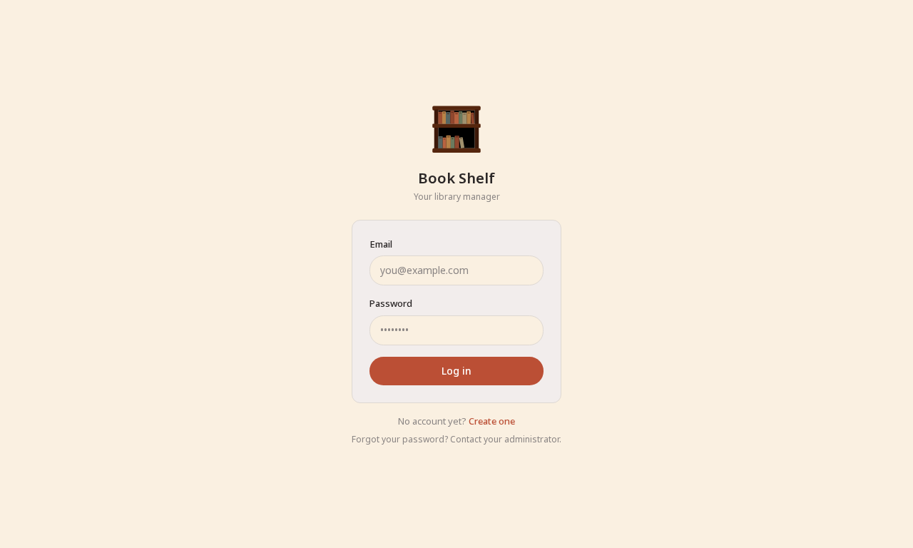
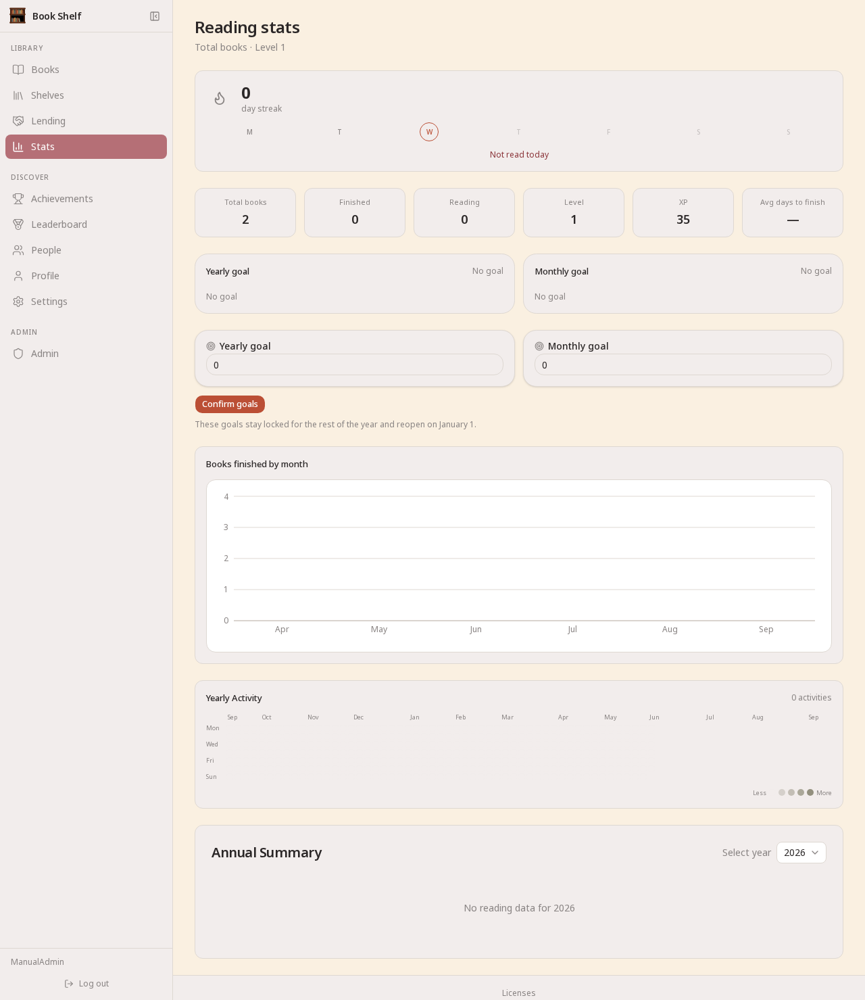
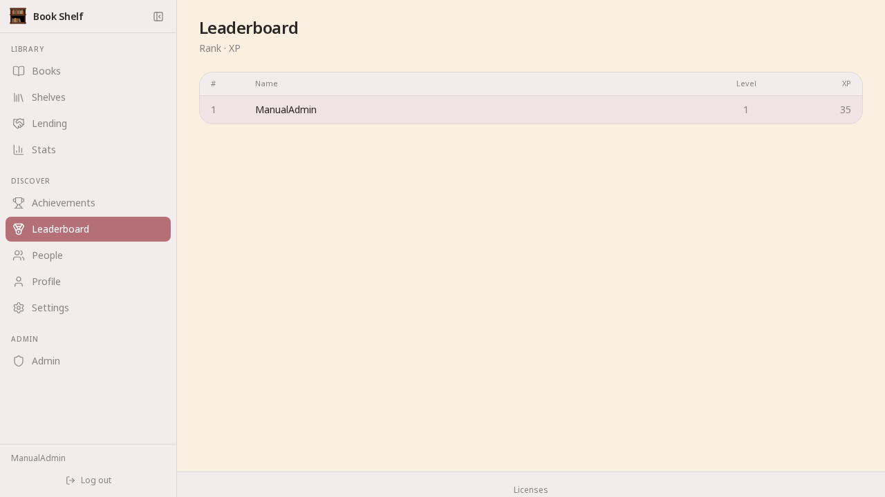

<h2 align="center">This Project Is Made Entirely With AI!</h2>

<div align="center">


# Book Shelf

**Your warm, calm, timeless personal library.**

*Fine Porcelain × Burnt Ochre · Ink & Copper · Noto Serif/Sans · 60/40 physical cards*

[](https://github.com/farukylmz0550/bookshelf-web/releases)
[](https://ghcr.io/farukylmz0550/bookshelf)
[](https://nextjs.org)
[](https://www.typescriptlang.org)

> **2.10.0** lifts the 2.9.x feature freeze: Shelves rename, bulk shelf picker, optional TOTP 2FA (mandatory for admins), admin danger zone with TOTP confirmation and admin-assigned password resets. See [`CHANGELOG.md`](CHANGELOG.md).

*Self-hosted · Private · No tracking · Your books, your data.*

[Features](#features) · [Screenshots](#screenshots) · [Quick Start](#quick-start) · [Tech Stack](#tech-stack) · [Design](#design)

</div>

---

> **Book Shelf** — Personal digital library experience. Track your books, lending history, goals and stats in a **warm, calm, timeless** interface. With Duolingo-style gamification.

---

## ✨ Features

| | Capability |
|---|---|
| 📚 **Library** | One-click ISBN (Open Library, full metadata: publishers, dates, languages, subjects, ISBN10/13) + detailed manual form (arrow → 14 fields) · Card/List toggle · Excel import/export |
| 🎴 **Cards** | Equal `h-[380px]` **60% cover / 40% meta** · `object-contain` · 12px radius · `2→3→4` responsive grid |
| 🗂️ **Shelves** | Create/rename/delete/reorder, optional color · bulk picker dialog (+ button per shelf — select books, one "Add" click) · many-to-many books · dedicated `/groups/[id]` grid view · main-page shelf filter (AND with tags/status/search) |
| 🤝 **Lending** | Lend / return, copy-aware, auto Person creation |
| 👥 **People** | Trust scores + lending history |
| 📊 **Stats** | Total/finished/reading, avg days, monthly chart, streak widget, heatmap |
| 🎮 **Gamification** | XP +5 add / +50 finish / +5 lend (+page & streak bonus) · Fibonacci level · 8 achievements |
| 🏆 **Leaderboard** | Top ranking, opt-out |
| 🎯 **Goals** | Yearly / monthly targets |
| 👤 **Profile** | Name, password, XP, join date |
| 🔢 **TOTP 2FA** | Optional TOTP (QR enrollment in Settings → Security) · mandatory for admin accounts · throttled per-account login attempts |
| 🌍 **i18n** | 6 languages (EN/TR/ES/FR/RU/ZH) — cookie, `src/i18n/dictionaries` |
| 🌓 **Theme** | Light ` #FAF0E1 / #BB4F35` · Dark ` #1D2020 / #C17A5E` · Noto · Sun/Moon SVG · Settings-only |
| 🍪 **Consent** | GDPR banner — desktop modal + mobile bar (Essential/Preferences/Analytics) |
| 🖥️ **Shell** | Collapsible sidebar (desktop, `sidebar-collapsed` cookie) + bottom nav (mobile) · `viewport-fit=cover` · safe-area |
| 📦 **PWA** | `manifest.json` shortcuts · `sw.js` · install prompt |
| 🔐 **Admin** | Approve/reject, promote/demote, delete users · cover cache · admin-assigned password resets (forced change at next login) · TOTP-confirmed danger zone that deletes all non-admin accounts · admins cannot act on their own account |
| 🎴 **Brand** | `brand/` set — Color + Symbolic masters, all icons rendered from the Color Master |
| 🐳 **Docker** | `ghcr.io/farukylmz0550/bookshelf` — one command |

### 📚 Documentation

| Document | Contents |
|---|---|
| [`CHANGELOG.md`](CHANGELOG.md) | Notable changes in every release |
| [`TROUBLESHOOTING.md`](TROUBLESHOOTING.md) | Symptom → cause → fix guides for self-hosting and daily use |
| [`SECURITY.md`](SECURITY.md) | How to report vulnerabilities, supported versions, scope |
| [`NOTICE.md`](NOTICE.md) | License table per directory (code, brand, audio) |
| [`CONTRIBUTING.md`](CONTRIBUTING.md) | Dev workflow, code style, testing before push |
| [`brand/README.md`](brand/README.md) | Brand set: masters, rendered icons, regeneration, usage rules |
| [`public/audio/annual/README.md`](public/audio/annual/README.md) | CC0 annual-summary music track list & metadata |
| [`LICENSE-GPLV3`](LICENSE-GPLV3) / [`LICENSE-CC-BY-NC-ND`](LICENSE-CC-BY-NC-ND) / [`LICENSE-CC0`](LICENSE-CC0) | Full license texts |

---

## 📸 Screenshots

<div align="center">

| Books — Card & List | Stats — Level & Goals | Leaderboard |
|---|---|---|
|  |  |  |
| *60/40 cards · 2→4 cols* | *Monthly chart · Streak* | *Top ranking* |

*Full flow: `npx playwright test e2e/manual-gui.spec.ts` → `e2e/screenshots/` (12 images)*

</div>

---

## 🎨 Design

**Character:** Classic · Academic · Cozy Library · Warm · Timeless — *"This is my library, and I like being here."*

| Theme | Background | Surface | Elevated | Accent | Text |
|---|---|---|---|---|---|
| **Light** Fine Porcelain × Burnt Ochre | `#FAF0E1` | `#F2EDEC` | `#FFFFFF` | `#BB4F35` | `#2B2727` |
| **Dark** Ink & Copper | `#1D2020` | `#272A29` | `#333735` | `#C17A5E` | `#F2EEE8` |

- **Typography:** Noto Serif (titles) · Noto Sans (ui) · Noto Mono (technical)
- **Cards:** Identical geometry, `rounded-[12px]`, subtle `border-strong` + `shadow-sm` on hover — no drag-drop
- **Brand:** `brand/` — Color & Symbolic masters + all generated icons (CC BY-NC-ND)
- **Sources:** `UI_Design_Language.md` · `Architecture_Principles.md` · `Project_Rules.md`

---

## 🚀 Quick Start

> **Problems?** See [`TROUBLESHOOTING.md`](TROUBLESHOOTING.md) — startup, login/TOTP recovery, lending, import, PWA and dev-environment fixes.

### Docker — pre-built (easiest)

```bash
cat > docker-compose.yml << 'EOF'
services:
  app:
    image: ghcr.io/farukylmz0550/bookshelf:latest
    restart: unless-stopped
    environment:
      DATABASE_URL: file:/data/bookshelf.db
      NEXTAUTH_SECRET: ${NEXTAUTH_SECRET}
      NEXTAUTH_URL: ${NEXTAUTH_URL}
      VAPID_PUBLIC_KEY: ${VAPID_PUBLIC_KEY:-}
      VAPID_PRIVATE_KEY: ${VAPID_PRIVATE_KEY:-}
      VAPID_SUBJECT: ${VAPID_SUBJECT:-}
      CRON_SECRET: ${CRON_SECRET:-}
    ports:
      - "${APP_PORT:-1024}:3000"
    volumes:
      - app-data:/data

  cron:
    image: ghcr.io/farukylmz0550/bookshelf:latest
    restart: unless-stopped
    depends_on:
      - app
    entrypoint: ["node", "-e"]
    command: >
      "const auth = 'Bearer ' + process.env.CRON_SECRET;
       const urls = [
         ['streak-remind', 'http://app:3000/api/push/streak-remind'],
         ['overdue-remind', 'http://app:3000/api/push/overdue-remind']
       ];
       async function tick() {
         for (const [name, url] of urls) {
           try {
             const res = await fetch(url, { method: 'POST', headers: { Authorization: auth } });
             console.log('[cron]', name + ':', res.status);
           } catch (err) { console.log('[cron] failed:', name, err.message); }
         }
       }
       (async () => { await tick(); })();
       setInterval(tick, 24 * 60 * 60 * 1000);"
    environment:
      CRON_SECRET: ${CRON_SECRET:-}
volumes:
  app-data:
EOF

echo "NEXTAUTH_SECRET=$(openssl rand -base64 32)" > .env
echo "CRON_SECRET=$(openssl rand -base64 32)" >> .env
docker compose up -d
# → http://localhost:1024
```

### Build from source

```bash
git clone https://github.com/farukylmz0550/bookshelf-web.git
cd bookshelf-web
cp .env.example .env  # set NEXTAUTH_SECRET=$(openssl rand -base64 32)
docker compose up -d --build
```

### Upgrading to 2.9.2 — non-root container

Since 2.9.2 the container runs as an unprivileged user (`nextjs`) instead of root. Fresh installs work out of the box. On an **existing** installation, the SQLite database inside the `app-data` volume is still owned by root, so the first start after upgrading will fail on migration with a permission error. Fix it once:

```bash
docker compose down
docker compose run --rm --user root --entrypoint chown app -R nextjs:nodejs /data
docker compose up -d
```

If you use a **bind mount** instead of the named volume, make sure the host data directory is writable by the container user (uid/gid of `nextjs` — run `docker run --rm ghcr.io/farukylmz0550/bookshelf:latest id nextjs` to look it up), e.g. `sudo chown -R <uid>:<gid> /path/to/data` on the host.

### Local dev

```bash
git clone https://github.com/farukylmz0550/bookshelf-web.git && cd bookshelf-web
npm install
npx prisma migrate dev
npm run db:seed
npm run dev  # → http://localhost:3000
```

**First run:** `/setup` → create admin → `/login` → approval at `/admin/users` → add books.

---

## 🧱 Tech Stack

| Layer | Tech |
|---|---|
| Framework | Next.js 16 (App Router) + TypeScript `strict` |
| UI | Tailwind 4 · shadcn/ui · lucide-react (Sun/Moon ISC) · Recharts · Noto |
| DB | SQLite · Prisma 7 (`better-sqlite3`) |
| Auth | NextAuth v5 (Credentials/JWT/bcrypt, approval guard) |
| Validation | Zod (trim, max, url) |
| Format | Prettier + ESLint (`flat` + `prettier`) |
| Test | Vitest 97 unit · Playwright 25 e2e |
| i18n | Cookie locale, 6 dicts |
| Theme | Cookie `light/dark` (consent-gated) |
| PWA | `sw.js` + `manifest.json` + `sw-register.tsx` |
| Deploy | Docker multi-stage · GHCR |

---

## 📁 Project Structure

<details>
<summary>Click to expand</summary>

```
bookshelf/
├── src/
│   ├── app/
│   │   ├── (dashboard)/
│   │   │   ├── books/            # Card/List toggle · ISBN one-click + detailed arrow · filters · Excel
│   │   │   │   ├── books-add-section.tsx
│   │   │   │   ├── book-card.tsx          # h-[380px] 60/40 object-contain
│   │   │   │   ├── books-grid.tsx
│   │   │   │   └── [id]/                 # detail / edit / lending / personal
│   │   │   ├── lending/ · people/ · stats/ · achievements/ · leaderboard/ · profile/ · settings/ · more/ · admin/
│   │   │   └── layout.tsx        # Hybrid shell: sidebar (desktop) + bottom-nav (mobile)
│   │   ├── actions/              # books/lending/people/goals/excel/profile/covers/admin/locale/theme/logout/settings/cookies
│   │   ├── api/                  # auth / test/reset / streak / well-known
│   │   └── login/register/setup/
│   ├── components/
│   │   ├── ui/                   # shadcn (token-aware)
│   │   ├── sidebar.tsx           # collapsible, cookie sidebar-collapsed
│   │   ├── bottom-nav.tsx        # safe-area
│   │   └── cookie-consent.tsx    # desktop modal / mobile bar
│   ├── lib/
│   │   ├── books/ · cookies* · isbn.ts (full meta) · gamification-pure.ts (Fibonacci) · streak.ts
│   │   └── theme.ts              # light/dark only
│   └── i18n/  auth.ts  proxy.ts
├── prisma/  schema.prisma  seed.ts/cjs  migrations/
├── e2e/  *.spec.ts  screenshots/
├── public/  sw.js  manifest.json  icon.svg
├── UI_Design_Language.md  Architecture_Principles.md  Project_Rules.md
├── Dockerfile  docker-compose.yml  vitest.config.ts
```

</details>

---

## 🗃️ Data Model

```
User ──────┬── Book ──────── LendingRecord
           ├── Person ────── LendingRecord
           ├── Goal
           └── UserAchievement ── Achievement
```

| Model | Key fields |
|---|---|
| **User** | email, passwordHash, name, isAdmin, approved, xp, streak |
| **Book** | isbn/title/author/coverUrl/status/rating/tags/copies + subtitle/publishers/publishDate/publishPlaces/edition/series/pages/languages/isbn10/13/subjects (full Open Library) |
| **Person** | name (unique per user) |
| **LendingRecord** | book, borrower, lentAt, returnedAt, bookTitle, personId |
| **Goal / Achievement / UserAchievement** | yearly/monthly, 8 achievements |

---

## 🔧 Server Actions

All mutations via `src/app/actions/` — `awardXp()` + `syncAchievements()` after:

| File | Mutations |
|---|---|
| `books` | `add` (full meta) · `update` · `delete` · `setStatus` · `lookupIsbn` (one-click) |
| `lending` | `create` · `return` |
| `people` | `create` · `remove` |
| `goals` | `set yearly/monthly` |
| `excel` | `export` · `template` · `import` |
| `profile` | `updateName` · `changePassword` |
| `admin` | `approve/reject` · `toggleAdmin` · `deleteUser` |
| `locale` / `theme` | `switch` (consent-gated, Settings-only) |
| `settings` / `cookies` | `updateSettings` · `setConsentCookie` |

---

## 🔑 Environment

| Variable | Required | Default | Description |
|---|---|---|---|
| `DATABASE_URL` | Yes | `file:./prisma/dev.db` | SQLite path |
| `NEXTAUTH_SECRET` | Yes | — | JWT secret |
| `NEXTAUTH_URL` | No | `http://localhost:3000` | App URL |
| `APP_PORT` | No | `3000` | Docker port |
| `RESET_SECRET` | No | — | `/api/test/reset` |
| `ALLOW_REGISTRATION` | No | `true` | `false` to disable public sign-up |
| `VAPID_PUBLIC_KEY` / `VAPID_PRIVATE_KEY` | No | — | Web Push — `npx web-push generate-vapid-keys` |
| `VAPID_SUBJECT` | No | `mailto:…` | Push contact URL |
| `CRON_SECRET` | No | — | Bearer token for the cron service (`/api/push/streak-remind`) |
| `READ_EVENT_PAGES` | No | `20` | Pages logged per "I read N pages" click |
| `XP_BOOK_ADDED` | No | `5` | XP per added book |
| `XP_BOOK_FINISHED_BASE` | No | `50` | XP base for finishing a book |
| `XP_PAGES_PER_10` | No | `3` | XP per 10 read pages |
| `XP_LENDING` | No | `5` | XP per lending |
| `XP_PER_LEVEL_BASE` | No | `100` | Fibonacci level-curve base XP |

---

## ✅ Testing

```bash
npm test              # 97 unit (vitest)
npx playwright test   # 25 e2e (chromium, webServer: npm run dev)
npm run lint
npm run format:check
```

---

## 🤝 Contributing

See [`CONTRIBUTING.md`](CONTRIBUTING.md) — TypeScript strict, Prettier 120 width, Conventional Commits, `npm run lint && npm run format:check && npm test` before push.

---

## ⚠️ Disclaimer

**General Disclaimer**

Book Shelf is provided for organizing, viewing and managing books and book-related information. Information displayed in the app may be provided by third-party sources (e.g. Open Library) and its accuracy, timeliness or completeness is not guaranteed.

Book Shelf is only an auxiliary tool. Information provided by the app does not substitute professional, academic, legal, financial or any other expert advice.

To the extent permitted by applicable law, the developer cannot be held liable for any consequences arising from the use of the app or of the information contained in the app.

Third-party content and services remain subject to their own licenses, terms of use and liability provisions.

---

## 📄 License

**GPLv3** — Only source code is licensed under the GPLV3 license

**CC-BY-NC-ND** — The Book Shelf logo, brand assets, and all materials contained within the brand set directory are licensed under the CC BY-NC-ND 4.0 license.

**CC0** — The rendered music files in `public/audio/annual/` are licensed under the CC0 1.0 Universal license (dedicated to the public domain) — see [`LICENSE-CC0`](LICENSE-CC0).

**Book Shelf** — is an unregistered trademark that identifies the Book Shelf project and the brand associated with the project.

**The Book Shelf name, logo, and brand identity are not licensed under the GNU GPLv3.** Use of the Book Shelf source code under the GNU GPLv3 does not grant any trademark rights to use the Book Shelf name or brand identity.

Forked and modified versions of the software may be used and distributed under the terms of the GNU GPLv3. However, unless separate permission to use the Book Shelf trademark is granted, such versions must use a different project name and brand identity.

The Book Shelf name or logo must not be used in a way that creates the impression that a project is approved, supported, endorsed, or officially associated with Book Shelf.

**Master files:** [`brand/Bookshelf — Color Master.svg`](https://github.com/farukylmz0550/bookshelf-web/blob/main/brand/Bookshelf%20%E2%80%94%20Color%20Master.svg) · [`brand/Bookshelf — Symbolic Master.svg`](https://github.com/farukylmz0550/bookshelf-web/blob/main/brand/Bookshelf%20%E2%80%94%20Symbolic%20Master.svg)

### Third-party licenses

Every technology Book Shelf is built on, linked together with its original license text:

| Technology | License |
|---|---|
| [Next.js](https://nextjs.org) | [MIT](https://github.com/vercel/next.js/blob/canary/license) |
| [React](https://react.dev) | [MIT](https://github.com/facebook/react/blob/main/LICENSE) |
| [NextAuth.js](https://nextjs.authjs.dev) | [ISC](https://github.com/nextauthjs/next-auth/blob/main/license) |
| [Prisma](https://www.prisma.io) | [Apache-2.0](https://github.com/prisma/prisma/blob/main/LICENSE) |
| [better-sqlite3](https://github.com/WiseLibs/better-sqlite3) | [MIT](https://github.com/WiseLibs/better-sqlite3/blob/master/LICENSE) |
| [Tailwind CSS](https://tailwindcss.com) | [MIT](https://github.com/tailwindlabs/tailwindcss/blob/main/LICENSE) |
| [shadcn/ui](https://ui.shadcn.com) | [MIT](https://github.com/shadcn-ui/ui/blob/main/LICENSE.md) |
| [Lucide](https://lucide.dev) | [ISC](https://github.com/lucide-icons/lucide/blob/main/LICENSE) |
| [Recharts](https://recharts.org) | [MIT](https://github.com/recharts/recharts/blob/master/LICENSE) |
| [Zod](https://zod.dev) | [MIT](https://github.com/colinhacks/zod/blob/main/LICENSE.md) |
| [bcryptjs](https://github.com/dcodeIO/bcrypt.js) | [BSD-3-Clause](https://github.com/dcodeIO/bcrypt.js/blob/master/LICENSE) |
| [ExcelJS](https://exceljs.org) | [MIT](https://github.com/exceljs/exceljs/blob/master/LICENSE) |
| [Sonner](https://sonner.emilkowal.ski) | [MIT](https://github.com/emilkowalski/sonner/blob/main/license.md) |
| [next-themes](https://github.com/pacocoursey/next-themes) | [MIT](https://github.com/pacocoursey/next-themes/blob/main/license) |
| [otplib](https://otplib.yeojz.dev) | [MIT](https://github.com/yeojz/otplib/blob/main/LICENSE) |
| [qrcode](https://github.com/soldair/node-qrcode) | [MIT](https://github.com/soldair/node-qrcode/blob/master/license) |
| [web-push](https://github.com/web-push-libs/web-push) | [MPL-2.0](https://github.com/web-push-libs/web-push/blob/master/LICENSE) |
| [html5-qrcode](https://github.com/mebjas/html5-qrcode) | [Apache-2.0](https://github.com/mebjas/html5-qrcode/blob/master/LICENSE) |
| [TypeScript](https://www.typescriptlang.org) | [Apache-2.0](https://github.com/microsoft/TypeScript/blob/main/LICENSE.txt) |
| [ESLint](https://eslint.org) | [MIT](https://github.com/eslint/eslint/blob/main/LICENSE) |
| [Prettier](https://prettier.io) | [MIT](https://github.com/prettier/prettier/blob/main/LICENSE) |
| [Vitest](https://vitest.dev) | [MIT](https://github.com/vitest-dev/vitest/blob/main/LICENSE) |
| [Playwright](https://playwright.dev) | [Apache-2.0](https://github.com/microsoft/playwright/blob/main/LICENSE) |
| [class-variance-authority](https://cva.tech) | [Apache-2.0](https://github.com/joe-bell/cva/blob/main/LICENSE) |
| [clsx](https://github.com/lukeed/clsx) | [MIT](https://github.com/lukeed/clsx/blob/master/license) |
| [tailwind-merge](https://github.com/dcastil/tailwind-merge) | [MIT](https://github.com/dcastil/tailwind-merge/blob/main/license) |
| [tw-animate-css](https://github.com/Wahbidev/tw-animate-css) | [MIT](https://github.com/wahbidev/tw-animate-css/blob/main/LICENSE) |
| [Base UI](https://base-ui.com) | [MIT](https://github.com/mui/base-ui/blob/master/LICENSE) |
| [Docker](https://www.docker.com) | [Apache-2.0](https://github.com/moby/moby/blob/master/LICENSE) |

<div align="center">

*Cozy Library + Personal Collection · Clarity before decoration.*

**[⬆ back to top](#book-shelf)**

</div>
